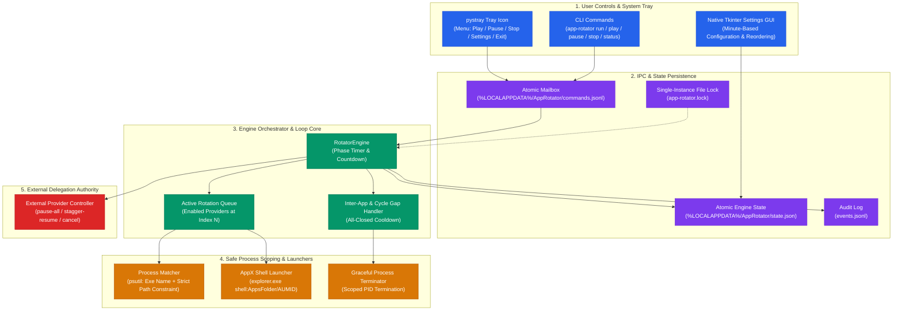
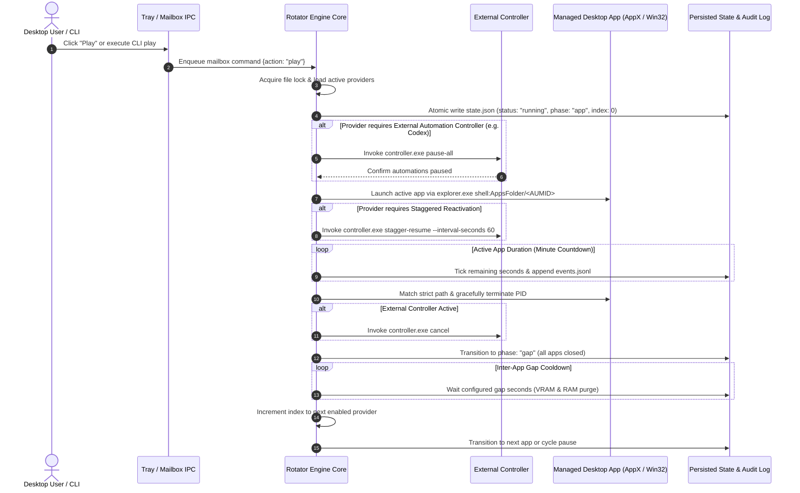

# App Rotator

<p align="center">
  <strong>Configurable, Fail-Closed Windows Tray Rotator for Resource-Heavy Desktop Apps</strong><br>
  <em>Time-slicing local AI applications (Codex Desktop, Claude Desktop, Antigravity IDE) to eliminate VRAM exhaustion, GPU contention, and background runaway execution.</em>
</p>

<p align="center">
  <a href="README.md"><strong>English</strong></a> |
  <a href="README_de.md"><strong>Deutsch</strong></a>
</p>

<p align="center">
  <a href="https://github.com/dev-bricks/app-rotator/actions/workflows/tests.yml"></a>
  <a href="https://github.com/dev-bricks/app-rotator/releases"></a>
  <a href="https://github.com/dev-bricks/app-rotator"></a>
  <a href="https://www.python.org/"></a>
  <a href="https://github.com/dev-bricks/app-rotator"></a>
  <a href="LICENSE"></a>
  <a href="SECURITY.md"></a>
  <a href="SECURITY.md"></a>
  <a href="SECURITY.md"></a>
  <a href="https://astral.sh/ruff"></a>
  <a href="https://github.com/dev-bricks"></a>
  <a href="https://github.com/open-bricks"></a>
  <a href="llms.txt"></a>
  <a href="MARKETING-LOG.txt"></a>
</p>

---

### 🧭 Quick Navigation

- [1. Why This Exists](#why-this-exists)
- [2. Architecture & State Machine Flow](#architecture--state-machine-flow)
- [3. State & Cycle Dynamics](#state--cycle-dynamics)
- [4. Safe Process Scoping & AppX Launching](#safe-process-scoping--appx-launching)
- [5. External Codex Safe-Start Contract](#external-codex-safe-start-contract)
- [6. System Tray & Native Settings UI](#system-tray--native-settings-ui)
- [7. Per-User Desktop Installation](#per-user-desktop-installation)
- [8. Key Governance & Runtime Invariants](#key-governance--runtime-invariants)
- [9. End-to-End Execution Lifecycle](#end-to-end-execution-lifecycle)
- [10. Sibling Tools & Ecosystem Matrix](#sibling-tools--ecosystem-matrix)
- [11. Installation & CLI Usage](#installation--cli-usage)
- [12. Configuration & Schema Migration](#configuration--schema-migration)
- [13. Security & Zero-Egress Privacy](#security--zero-egress-privacy)
- [14. Development & Verification](#development--verification)

---

## Why This Exists

Modern agentic engineering workflows rely heavily on local, autonomous AI desktop environments—specifically **Codex Desktop**, **Claude Desktop**, and **Antigravity IDE**. When executed concurrently or left unattended, these environments produce severe system contention:

1. **VRAM Exhaustion & GPU Thrashing**: Local inference engines and GPU-accelerated WebView UI layers compete for dedicated video RAM, causing driver resets, frame drops, and severe latency spikes.
2. **Memory Leaks & CPU Contention**: Unbounded background execution and continuous indexing loops consume excess system memory, starving adjacent compilation and development tools.
3. **Runaway Background Automation**: Subagents, file watchers, and MCP servers spawned by inactive desktop environments continue executing in the background, creating unintended race conditions on shared repositories.
4. **Thermal Throttling & Power Waste**: Concurrent heavy desktop clients force workstations into sustained maximum power states, degrading thermal headroom.

`app-rotator` solves these problems through disciplined, time-sliced desktop orchestration. It operates as a local Windows tray controller that strictly serializes desktop applications: **exactly one configured heavy app runs at any time**. When an app's scheduled allotment expires, App Rotator gracefully terminates it, enters an all-closed inter-app gap to allow full VRAM and garbage collection release, and launches the next configured provider.

The shipped configuration is deliberately **disabled and set to dry-run by default**. It logs intended actions but cannot launch or terminate processes until explicitly enabled by the user.

---

## Architecture & State Machine Flow

The following architecture diagram illustrates the decoupled subsystems of `app-rotator`:



---

## State & Cycle Dynamics

App Rotator enforces a deterministic state machine across four primary lifecycle states:

- **Stopped**: All managed apps are confirmed closed. The loop index is reset to `0`. Clicking *Play* closes any residual processes and starts provider `0` with a fresh timer.
- **Running**: The engine actively manages a phase. In an `app` phase, the current provider process is monitored. In a `gap` or `cycle_pause` phase, all apps remain strictly closed.
- **Paused**: Clicking *Pause* closes the active app immediately, dispatches a cancellation signal to external controllers, and freezes the loop state—retaining the active phase, provider index, and exact remaining seconds.
- **Play from Paused**: Resumes the exact frozen phase and remaining countdown. If resumed during an `app` phase, the provider is launched fresh.
- **Stop / Aus**: Gracefully closes the active app, dispatches external controller `cancel`, flushes state, and resets the loop index to `0`.
- **Automatic Overall Stop**: An optional active runtime watchdog (`overall_stop_seconds`) triggers the same safe *Stop* operation after total cumulative active operation. Time spent paused does not deplete the overall budget.
- **Loop Progression Sequence**:
  $$\text{App Phase } N \longrightarrow \text{Inter-App Gap} \longrightarrow \text{App Phase } N+1 \longrightarrow \dots \longrightarrow \text{Cycle Pause} \longrightarrow \text{App Phase } 0$$

All state changes write atomically to `%LOCALAPPDATA%\AppRotator\state.json` via temporary files and atomic replacement (`os.replace`), ensuring that abrupt power interruptions cannot corrupt state files.

---

## Safe Process Scoping & AppX Launching

Terminating processes on an operating system carries severe risks if selectors are loosely defined. App Rotator enforces strict, fail-closed scoping rules:

1. **Dual Criteria Requirement**: An app configuration must specify both a target executable name (`ChatGPT.exe`) **and exactly one path constraint** (`path_exact` or `path_contains`).
2. **Zero Wildcards on Unchecked Executables**: Processes without readable executable paths or running under elevated foreign security tokens are completely ignored.
3. **CLI / Developer Tool Immunity**: By restricting Codex Desktop matching strictly to `WindowsApps\OpenAI.Codex_`, any command-line tools such as npm `codex.exe` or terminal instances running from developer directories remain completely outside the kill scope.
4. **AppX Packaging Protocol**: Modern UWP/MSIX packaged apps cannot be launched via simple direct `.exe` paths due to Windows sandboxing. App Rotator launches them via the Windows Shell AppFolder protocol:
   ```text
   explorer.exe shell:AppsFolder\<AUMID>
   ```
   Default built-in AUMIDs include:
   - **Codex Desktop**: `OpenAI.Codex_2p2nqsd0c76g0!App`
   - **Claude Desktop**: `Claude_pzs8sxrjxfjjc!Claude`
   - **Antigravity**: Targeted via verified absolute binary path (`path_exact`)

---

## External Codex Safe-Start Contract

App Rotator strictly adheres to the Single Responsibility Principle: **it never parses, modifies, or writes to internal provider files like `automation.toml`**.

Instead, provider-specific orchestration is delegated to an unbundled, user-specified external executable controller:


```text
controller.exe pause-all
controller.exe stagger-resume --interval-seconds 60
controller.exe cancel
```

### Delegation Protocol:
1. **Prior to Codex Launch**: The engine invokes `controller.exe pause-all` to ensure no background tasks trigger simultaneous executions.
2. **Post-Launch Staggering**: Once Codex initializes, the engine invokes `controller.exe stagger-resume --interval-seconds 60` to reactivate automations progressively without overwhelming system resources.
3. **On Phase Exit / Pause / Stop**: The engine dispatches `controller.exe cancel` to immediately abort any pending reactivation requests.
4. **Fail-Closed Missing Controller Policy**: If the configured controller binary is absent:
   - `missing_behavior: "block"` (Default): The engine halts rotation, transitions to an alert state, and logs a clear explanatory reason.
   - `missing_behavior: "skip"`: The engine explicitly skips the Codex stage and proceeds safely to the next provider.
   - **Dry-Run**: Records contract calls to the audit log without executing subcommands.

---

## System Tray & Native Settings UI

The desktop user interface is designed for zero intrusion and native responsiveness:

- **System Tray Icon (`pystray`)**:
  - Color-coded icon states reflecting engine status (Idle, Active, Paused, Cooldown).
  - Context menu displays current provider, active phase, and remaining countdown.
  - One-click commands: *Play*, *Pause*, *Stop*, *Settings*, and *Exit*.
- **Native Settings GUI (`tkinter`)**:
  - Entirely local, responsive configuration editor.
  - **Minute-Based Inputs**: All user-facing durations (provider runtime, inter-app gaps, cycle pauses, overall runtime, and reactivation intervals) are entered and displayed in **minutes** for human convenience. Internally, the engine computes and stores exact seconds.
  - **Provider Management**: Dedicated checkboxes (*Enabled / in rotation*) permit temporarily disabling specific providers without deleting their configuration. Built-in providers (Codex, Claude, Antigravity) cannot be accidentally deleted and can be reordered seamlessly.

---

## Per-User Desktop Installation

App Rotator provides an unprivileged, per-user installation script:

```powershell
.\scripts\install-desktop-shortcut.ps1
```

### Installer Guarantees:
- **Zero Administrator Elevation**: Installs entirely inside the current user profile under `%LOCALAPPDATA%\Programs\AppRotator`.
- **Desktop Shortcut Independence**: Resolves the true Windows Shell Desktop folder path via the Windows API, creating a permanent desktop icon that functions independently of repository locations or cloud synchronization folders.
- **Automatic Environment Scaffolding**: Provisions an isolated per-user Python virtual environment, installs App Rotator in user mode, copies packaged high-resolution application icons, and seeds the initial fail-closed configuration.

---

## Key Governance & Runtime Invariants

The following 10 invariants govern every operation of `app-rotator`:

| Guarantee | Invariant Code | Enforcement Mechanism | Verification Rule |
| :--- | :--- | :--- | :--- |
| **1. 100% Local-First Privacy** | `INV-LOCAL-01` | Zero telemetry, analytics, or network socket bindings. | Code inspection confirms zero outbound HTTP/network requests. |
| **2. Unprivileged Execution** | `INV-UNPRIV-02` | Standard user context (`RunAsInvoker`), no elevation. | `SECURITY.md` and runtime checks verify non-elevated operation. |
| **3. Fail-Closed Dry-Run** | `INV-DRYRUN-03` | Default config delivered with `enabled: false`, `dry_run: true`. | Clean installation test verifies no process actions without opt-in. |
| **4. Strict Path Scoping** | `INV-SCOPING-04` | Process matching requires executable name + path constraint. | psutil audit rejects unmatched or ambiguous process names. |
| **5. Atomic Persistence** | `INV-ATOMIC-05` | State and mailbox writes execute via temporary file + replace. | Power-loss fault tolerance tests confirm non-corrupting writes. |
| **6. Provider Delegation** | `INV-DELEGATION-06` | External provider automation controlled via external CLI. | Zero direct reads or modifications of provider internal configs. |
| **7. Single-Instance Mutex** | `INV-LOCKFILE-07` | Exclusive file lock (`app-rotator.lock`) on run and tray. | Second process launch aborts immediately with exit code 0/1. |
| **8. Non-Invasive AppX** | `INV-AUMID-08` | UWP/MSIX activation via standard Windows Shell AppFolder. | Subprocess invocations use fixed parameter vectors without shell. |
| **9. Cloud-Sync Resilience** | `INV-SYNC-09` | Runtime state below `%LOCALAPPDATA%`; `.gitignore` conflict filters. | State path outside OneDrive; `.gitignore` contains sync patterns. |
| **10. 48h Security SLA** | `INV-SLA-10` | 48h vulnerability acknowledgment and 5-day triage commitment. | Documented in `SECURITY.md` and validated in contract tests. |

---

## End-to-End Execution Lifecycle

The following sequence diagram traces an end-to-end execution cycle:



---

## Sibling Tools & Ecosystem Matrix

`app-rotator` operates within the **dev-bricks** software family under the **open-bricks** open-source ecosystem:

| Repository | Domain & Purpose | Integration with App Rotator |
| :--- | :--- | :--- |
| [WikiStub-Seed](https://github.com/dev-bricks/WikiStub-Seed) | World-Building & Markdown Documentation Tools | Provides structured technical knowledge bases. |
| [PrivacyMailDesk](https://github.com/dev-bricks/privacymaildesk) | Local-First Private Email Triage & Review | Zero-egress local communication desk. |
| [githubbot](https://github.com/dev-bricks/githubbot) | Multi-Repository GitHub Ecosystem Orchestration | Manages releases, metadata parity, and CI hygiene. |
| [system-auditor](https://github.com/ellmos-ai/system-auditor) | Multi-Host Audit Engine & Lock Governance | Audits file mutexes and multi-host synchronization status. |
| [system-explorer](https://github.com/ellmos-ai/system-explorer) | Local System Introspection & Hardware Discovery | Inspects process memory, GPU utilization, and system thermals. |
| [ellmos-controlcenter-mcp](https://github.com/ellmos-ai/ellmos-controlcenter-mcp) | Governance & Capability Routing Hub | Governs tool allocations and operational boundaries. |
| [ellmos-delegation-authority](https://github.com/ellmos-ai/ellmos-delegation-authority) | Cryptographic Task Delegation Tokens | Provides receipt-based delegation for automated workflows. |
| [sqlite-transit-sync](https://github.com/ellmos-ai/sqlite-transit-sync) | Zero-Conflict Database Synchronization | Manages atomic state sync across multi-host environments. |
| [clip-storyboard-director](https://github.com/ellmos-ai/clip-storyboard-director) | Local-First AI Video Directing Pipeline | Heavy client benefited by scheduled time-sliced execution. |
| [ellmos-voice-io](https://github.com/ellmos-ai/ellmos-voice-io) | Speech Synthesis & Audio Streaming Engine | Local audio engine managed in rotation. |
| [automation-master](https://github.com/ellmos-ai/automation-master) | Enterprise Background Task Scheduling | Coordinates headless background job triggers. |
| [ExplorerPro](https://github.com/file-bricks/ExplorerPro) | Tabbed Desktop File Manager | High-productivity file explorer for development assets. |
| [ProSync](https://github.com/file-bricks/prosync) | Resilient File Mirroring & Backup Utility | Synchronizes project backups across local volumes. |
| [CleanMarkdown](https://github.com/doc-bricks/cleanmarkdown) | Markdown Document Sanitizer & Linter | Normalizes markdown documentation and notes. |
| [KlangpultLight](https://github.com/entertain-and-more/KlangpultLight) | Zero-Egress Soundboard & Desktop Audio Recorder | Media companion utility for live sessions. |
| [open-bricks](https://github.com/open-bricks) | Umbrella Open-Source Ecosystem | Architectural standards, security SLAs, and release governance. |

---

## Installation & CLI Usage

### Requirements
- **Operating System**: Microsoft Windows 10 or Windows 11 (64-bit)
- **Python**: Version 3.11, 3.12, or 3.13
- **Dependencies**: `Pillow`, `psutil`, `pystray`

### Installation

```powershell
$env:PYTHONIOENCODING = "utf-8"
python -m venv .venv
.\.venv\Scripts\python.exe -m pip install -e ".[dev]"
```

### Initial Configuration & Validation

```powershell
# Initialize default fail-closed configuration
app-rotator config-init

# Validate configuration structure and syntax
app-rotator config-validate
```

### CLI Command Reference

```powershell
# Start the system tray application
app-rotator tray

# Run the rotator engine in foreground console mode
app-rotator run

# Query current engine status, active provider, and countdown
app-rotator status

# Send atomic control commands via mailbox
app-rotator play
app-rotator pause
app-rotator stop
```

---

## Configuration & Schema Migration

App Rotator configuration is stored under `%LOCALAPPDATA%\AppRotator\config.json`.

```json
{
  "schema_version": 2,
  "enabled": false,
  "dry_run": true,
  "cycle_pause_seconds": 300,
  "default_gap_seconds": 60,
  "overall_stop_seconds": 0,
  "codex_controller": {
    "executable": "",
    "missing_behavior": "block",
    "reactivation_spacing_seconds": 60
  },
  "providers": [
    {
      "name": "Codex Desktop",
      "process_name": "ChatGPT.exe",
      "path_contains": "WindowsApps\\OpenAI.Codex_",
      "aumid": "OpenAI.Codex_2p2nqsd0c76g0!App",
      "duration_seconds": 1800,
      "enabled": true
    },
    {
      "name": "Claude Desktop",
      "process_name": "Claude.exe",
      "path_contains": "WindowsApps\\Claude_",
      "aumid": "Claude_pzs8sxrjxfjjc!Claude",
      "duration_seconds": 1800,
      "enabled": true
    },
    {
      "name": "Antigravity",
      "process_name": "Antigravity.exe",
      "path_exact": "C:\\Users\\User\\AppData\\Local\\Programs\\Antigravity\\Antigravity.exe",
      "executable": "C:\\Users\\User\\AppData\\Local\\Programs\\Antigravity\\Antigravity.exe",
      "duration_seconds": 1800,
      "enabled": false
    }
  ]
}
```

### Schema Migration Guarantees:
- **Automatic v1 to v2 Upgrade**: Older configurations are automatically upgraded to schema version 2 without data loss.
- **Additive Inactive Providers**: When older configurations are upgraded, newly recognized built-in providers are inserted with `enabled: false`, ensuring a live user rotation is never expanded silently.

---

## Security & Zero-Egress Privacy

App Rotator is engineered from the ground up for strict security:

- **Zero Network Ingestion or Egress**: Does not open outbound network connections, make telemetry calls, or contact remote servers.
- **Unprivileged Execution (`RunAsInvoker`)**: Never requires or requests administrative privileges. Runs entirely inside standard user context.
- **Strict Path Sandboxing**: Refuses to terminate processes without a verified, matched executable path on disk.
- **48-Hour Response SLA & 5-Day Triage**: We provide an initial response to security vulnerability disclosures within 48 hours and a comprehensive technical triage within 5 business days. See [SECURITY.md](SECURITY.md) for vulnerability reporting procedures.

---

## Development & Verification

### Running Linters & Bytecode Validation

```powershell
$env:PYTHONIOENCODING = "utf-8"
python -m ruff check .
python -m compileall -q src tests
```

### Running Test Suite

```powershell
$env:PYTHONIOENCODING = "utf-8"
python -m pytest -v
```

---

<p align="center">
  Part of the <strong><a href="https://github.com/dev-bricks">dev-bricks</a></strong> suite under the <strong><a href="https://github.com/open-bricks">open-bricks</a></strong> umbrella.
</p>
