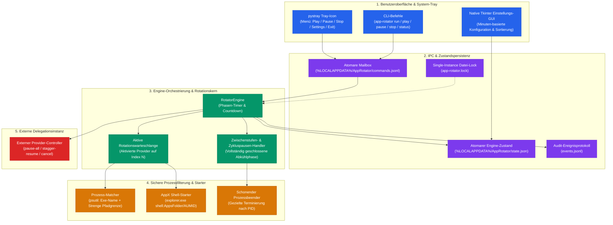
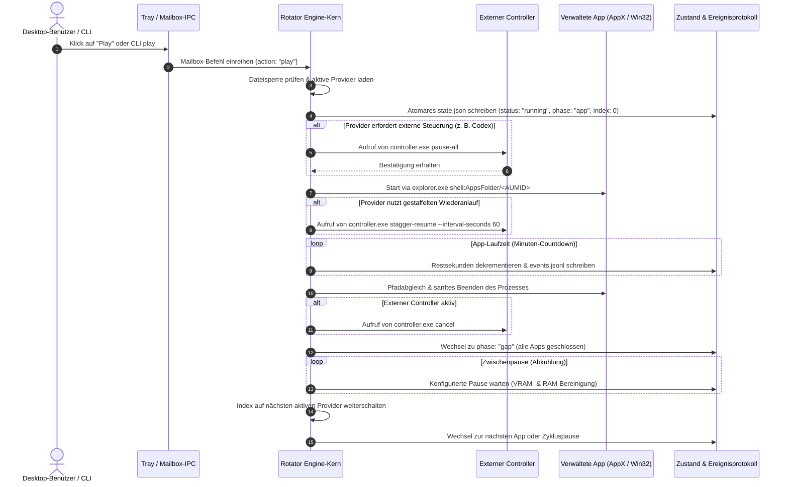

<p align="center">
  
</p>
<!-- alternate banner: assets/banner-b.svg (swap on occasion) -->

# App Rotator

<p align="center">
  <strong>Konfigurierbarer, Fail-Closed Windows-Tray-Rotator für ressourcenintensive Desktop-Apps</strong><br>
  <em>Deterministisches Time-Slicing lokaler KI-Anwendungen (Codex Desktop, Claude Desktop, Antigravity IDE) zur Vermeidung von VRAM-Erschöpfung, GPU-Konflikten und unkontrollierten Hintergrundprozessen.</em>
</p>

<p align="center">
  <a href="README.md"><strong>English</strong></a> |
  <a href="README_de.md"><strong>Deutsch</strong></a>
</p>

<p align="center">
  <a href="https://github.com/dev-bricks/app-rotator/actions/workflows/tests.yml"></a>
  <a href="https://github.com/dev-bricks/app-rotator/releases"></a>
  <a href="https://github.com/dev-bricks/app-rotator"></a>
  <a href="https://www.python.org/"></a>
  <a href="https://github.com/dev-bricks/app-rotator"></a>
  <a href="LICENSE"></a>
  <a href="NOTICE"></a>
  <a href="SECURITY.md"></a>
  <a href="SECURITY.md"></a>
  <a href="SECURITY.md"></a>
  <a href="https://astral.sh/ruff"></a>
  <a href="https://github.com/dev-bricks"></a>
  <a href="https://github.com/open-bricks"></a>
  <a href="llms.txt"></a>
  <a href="MARKETING-LOG.txt"></a>
</p>

---

### 🧭 Schnellnavigation

- [1. Warum dieses Projekt existiert](#warum-dieses-projekt-existiert)
- [2. Systemarchitektur & Zustandsautomaten-Fluss](#systemarchitektur--zustandsautomaten-fluss)
- [3. Zustandslogik & Zyklusdynamik](#zustandslogik--zyklusdynamik)
- [4. Sichere Prozessauswahl & AppX-Start](#sichere-prozessauswahl--appx-start)
- [5. Externer Codex-Safe-Start-Vertrag](#externer-codex-safe-start-vertrag)
- [6. System-Tray & Native Einstellungs-UI](#system-tray--native-einstellungs-ui)
- [7. Benutzerbezogene Desktop-Installation](#benutzerbezogene-desktop-installation)
- [8. Zielgruppen & Auffindbarkeit](#zielgruppen--auffindbarkeit)
- [9. 10-Dimensionale Vergleichsmatrix vs. Alternativen](#10-dimensionale-vergleichsmatrix-vs-alternativen)
- [10. Governance- & Laufzeit-Invarianten](#governance---laufzeit-invarianten)
- [11. End-to-End Ausführungslebenszyklus](#end-to-end-ausfuehrungslebenszyklus)
- [12. Geschwisterwerkzeuge & Partner-Matrix](#geschwisterwerkzeuge--partner-matrix)
- [13. Installation & CLI-Bedienung](#installation--cli-bedienung)
- [14. Konfiguration & Schema-Migration](#konfiguration--schema-migration)
- [15. Sicherheit & Zero-Egress-Datenschutz](#sicherheit--zero-egress-datenschutz)
- [16. Gesetzlicher Hinweis, Haftungsausschluss & Lizenz (§ 521 BGB)](#gesetzlicher-hinweis-haftungsausschluss--lizenz--521-bgb)
- [17. Entwicklung & Verifikation](#entwicklung--verifikation)

---

<a id="why-this-exists"></a><a id="warum-dieses-projekt-existiert"></a>
## Warum dieses Projekt existiert

Moderne KI- und Agenten-Entwicklungsworkflows stützen sich zunehmend auf lokale Desktop-Umgebungen wie **Codex Desktop**, **Claude Desktop** und die **Antigravity IDE**. Laufen mehrere dieser Schwergewichte gleichzeitig oder unbeaufsichtigt im Hintergrund, kommt es auf modernen Entwickler-Workstations rasch zu drastischen Engpässen:

1. **VRAM-Erschöpfung & GPU-Konflikte**: Lokale Inferenz-Engines und grafikbeschleunigte WebView-Oberflächen konkurrieren um dedizierten Videospeicher (VRAM). Dies führt zu Grafiktreiber-Resets, spürbaren Frame-Einbrüchen und blockierten Systemressourcen.
2. **Speicherlecks & CPU-Auslastung**: Unbegrenzte Hintergrundaktivitäten und permanente Datei-Indexierungsschleifen beanspruchen massiv Arbeitsspeicher und verlangsamen parallele Compiler und IDEs.
3. **Unkontrollierte Hintergrund-Automationen**: Von inaktiven Desktop-Apps gestartete Hintergrund-Agenten, Datei-Watcher und MCP-Server laufen unbemerkt weiter und erzeugen unkontrollierte Race Conditions auf geteilten Repositories.
4. **Thermisches Throttling & unnötige Leistungsaufnahme**: Dauerhaft parallel laufende Desktop-Clients halten Workstations in hohen Leistungszuständen, was Lüfterlärm und thermische Drosselung provoziert.

`app-rotator` löst diese Probleme durch diszipliniertes, zeitgesteuertes Desktop-Orchestrieren. Als lokaler Windows-Tray-Dienst stellt das Tool sicher, dass **zu jedem Zeitpunkt genau eine konfigurierte Anwendung aktiv ist**. Nach Ablauf des zugewiesenen Zeitfensters schließt App Rotator das Programm sauber, hält eine vollständige Leerlaufphase (Inter-App-Gap) zur Bereinigung von VRAM und Speicher-Caches ein und startet anschließend das nächste definierte Werkzeug.

Im Auslieferungszustand ist die Konfiguration **standardmäßig deaktiviert und im Dry-Run-Modus**. Sie protokolliert alle geplanten Schritte, ohne tatsächlich Prozesse zu beenden oder zu starten, bis der Anwender dies ausdrücklich aktiviert.

---

<a id="architecture--state-machine-flow"></a><a id="systemarchitektur--zustandsautomaten-fluss"></a>
## Systemarchitektur & Zustandsautomaten-Fluss

Das folgende Architekturdiagramm veranschaulicht das Zusammenspiel der entkoppelten Teilsysteme:



---

<a id="state--cycle-dynamics"></a><a id="zustandslogik--zyklusdynamik"></a>
## Zustandslogik & Zyklusdynamik

App Rotator erzwingt einen deterministischen Zustandsautomaten über vier primäre Lebenszyklus-Zustände:

- **Stopped / Aus**: Alle verwalteten Anwendungen sind garantiert geschlossen. Der Schleifenindex steht auf `0`. Ein Klick auf *Play* beendet verbleibende Restprozesse und startet Provider `0` mit frischem Zeitkontingent.
- **Running / Aktiv**: Die Engine führt eine aktive Phase aus. In einer `app`-Phase wird der konfigurierte Zielprozess überwacht. In einer `gap`- oder `cycle_pause`-Phase bleiben alle Anwendungen ausnahmslos geschlossen.
- **Paused / Pausiert**: Ein Klick auf *Pause* beendet die aktive App sofort, sendet ein Abbruchsignal an externe Controller und friert den Schleifenzustand ein – inklusive aktiver Phase, Index und verbleibender Restsekunden.
- **Play aus Pause**: Setzt exakt die eingefrorene Phase mit verbleibender Restzeit fort. Wurde während einer `app`-Phase pausiert, wird die Anwendung frisch neu gestartet.
- **Stop / Beenden**: Schließt die aktive Anwendung schonend, sendet den Abbruchbefehl an externe Controller, sichert den Zustand und setzt den Schleifenindex auf `0` zurück.
- **Automatischer Gesamtlaufzeit-Stop**: Ein konfigurierbarer Gesamtlaufzeit-Wächter (`overall_stop_seconds`) führt denselben sicheren *Stop*-Vorgang nach Erreichen des Budgets aus. Pausenzeiten belasten das Laufzeitkontingent nicht.
- **Schleifenabfolge**:
  $$\text{App Phase } N \longrightarrow \text{Inter-App Pause} \longrightarrow \text{App Phase } N+1 \longrightarrow \dots \longrightarrow \text{Zykluspause} \longrightarrow \text{App Phase } 0$$

Alle Zustandsänderungen werden über temporäre Dateien und atomares Ersetzen (`os.replace`) unter `%LOCALAPPDATA%\AppRotator\state.json` gespeichert, sodass abrupte Systemunterbrechungen niemals korrupte Dateien hinterlassen.

---

<a id="safe-process-scoping--appx-launching"></a><a id="sichere-prozessauswahl--appx-start"></a>
## Sichere Prozessauswahl & AppX-Start

Das Beenden von Betriebssystemprozessen birgt erhebliche Risiken, wenn Selektoren unscharf formuliert sind. App Rotator erzwingt strenge, Fail-Closed-Filterregeln:

1. **Zwei-Kriterien-Pflicht**: Eine App-Konfiguration muss zwingend sowohl den Dateinamen (`ChatGPT.exe`) **als auch genau eine Pfadrestriktion** (`path_exact` oder `path_contains`) definieren.
2. **Keine Wildcards auf ungeprüften Prozessen**: Prozesse ohne lesbare Ausführungspfade oder solche mit erhöhten fremden Sicherheits-Tokens werden strikt ignoriert.
3. **Schutz für CLI- und Entwicklerwerkzeuge**: Durch die strikte Einschränkung des Codex-Desktop-Pfads auf `WindowsApps\OpenAI.Codex_` bleiben CLI-Werkzeuge wie npm `codex.exe` oder Terminal-Instanzen aus Entwicklerverzeichnissen vollständig geschützt.
4. **AppX-Startprotokoll**: Moderne UWP-/MSIX-Apps können aufgrund der Windows-Sandbox-Isolation nicht über einfache `.exe`-Pfade gestartet werden. App Rotator nutzt das standardisierte Windows Shell AppFolder-Protokoll:
   ```text
   explorer.exe shell:AppsFolder\<AUMID>
   ```
   Standardmäßig hinterlegte AUMIDs umfassen:
   - **Codex Desktop**: `OpenAI.Codex_2p2nqsd0c76g0!App`
   - **Claude Desktop**: `Claude_pzs8sxrjxfjjc!Claude`
   - **Antigravity**: Direkter Start über verifizierten absoluten Binärpfad (`path_exact`)

---

<a id="external-codex-safe-start-contract"></a><a id="externer-codex-safe-start-vertrag"></a>
## Externer Codex-Safe-Start-Vertrag

App Rotator folgt strikt dem Single-Responsibility-Prinzip: **Es liest, modifiziert oder überschreibt niemals interne Provider-Konfigurationen wie `automation.toml`**.

Stattdessen wird die anwendungsspezifische Steuerung an einen externen, benutzerdefinierten Steuerungs-Controller delegiert:

```text
controller.exe pause-all
controller.exe stagger-resume --interval-seconds 60
controller.exe cancel
```

### Delegationsprotokoll:
1. **Vor dem Start von Codex**: Die Engine führt `controller.exe pause-all` aus, um gleichzeitige Hintergrund-Automationen vorab zu stoppen.
2. **Gestaffelte Reaktivierung**: Nach dem Start ruft die Engine `controller.exe stagger-resume --interval-seconds 60` auf, um geplante Aufgaben kontrolliert und schonend wieder anlaufen zu lassen.
3. **Beim Verlassen / Pausieren / Stoppen**: Die Engine sendet `controller.exe cancel`, um alle noch ausstehenden Reaktivierungsanfragen sofort zu verwerfen.
4. **Fehlender Controller (Fail-Closed-Richtlinie)**: Ist die konfigurierte Binärdatei nicht auffindbar:
   - `missing_behavior: "block"` (Standard): Die Engine stoppt die Rotation, meldet einen Alarmzustand und protokolliert die Ursache.
   - `missing_behavior: "skip"`: Die Engine überspringt die Codex-Phase sicher und fährt mit dem nächsten Provider fort.
   - **Dry-Run**: Zeichnet Delegationsaufrufe im Audit-Log auf, ohne Befehle abzusetzen.

---

<a id="system-tray--native-settings-ui"></a><a id="system-tray--native-einstellungs-ui"></a>
## System-Tray & Native Einstellungs-UI

Die Benutzeroberfläche arbeitet verzögerungsfrei und fügt sich nahtlos in Windows ein:

- **System-Tray-Icon (`pystray`)**:
  - Farbkodierte Status-Icons spiegeln den Zustand wider (Leerlauf, Aktiv, Pausiert, Abkühlpause).
  - Kontextmenü zeigt den aktuellen Provider, die Phase und die verbleibende Restzeit an.
  - Direkte Menüaktionen: *Play*, *Pause*, *Stop*, *Settings* und *Exit*.
- **Native Einstellungs-GUI (`tkinter`)**:
  - Leichtgewichtiges, lokales Einstellungsfenster ohne externe Web-Abhängigkeiten.
  - **Minuten-basierte Eingaben**: Alle Zeiträume (Laufzeiten der Apps, Zwischenpausen, Zykluspause, Gesamtlaufzeit, Reaktivierungsabstände) werden für den Nutzer intuitiv in **Minuten** gepflegt und angezeigt. Intern rechnet die Engine sekundengenau.
  - **Provider-Verwaltung**: Eigene Checkboxen (*Aktiv / in Rotation*) erlauben das temporäre Deaktivieren einzelner Anwendungen, ohne deren Pfadeinstellungen zu löschen. Die Standard-Apps können nicht versehentlich gelöscht und flexibel sortiert werden.

---

<a id="per-user-desktop-installation"></a><a id="benutzerbezogene-desktop-installation"></a>
## Benutzerbezogene Desktop-Installation

App Rotator enthält ein unprivilegiertes PowerShell-Installationsskript für den aktuellen Benutzer:

```powershell
.\scripts\install-desktop-shortcut.ps1
```

### Installationsgarantien:
- **Keine Administratorrechte erforderlich**: Die Installation erfolgt vollständig im Benutzerprofil unter `%LOCALAPPDATA%\Programs\AppRotator`.
- **Echte Desktop-Verknüpfung**: Ermittelt den tatsächlichen Windows-Desktop-Ordner über die Windows-API – unabhängig von OneDrive-Umleitungen oder lokalen Git-Pfaden.
- **Automatische Umgebungserstellung**: Erstellt eine isolierte virtuelle Python-Umgebung, installiert App Rotator im Benutzermodus, hinterlegt hochauflösende Icons und erzeugt die sichere Grundkonfiguration.

---

<a id="target-personas--high-intent-discoverability"></a><a id="zielgruppen--auffindbarkeit"></a>
## Zielgruppen & Auffindbarkeit

App Rotator wurde für Entwickler und Power-User konzipiert, die mehrere ressourcenintensive KI-Desktop-Clients auf lokalen Workstations betreiben:

### `[PERSONA-01]` Autonome KI-Desktop-Entwickler & Swarm-Operatoren
- **Profil**: Software-Ingenieure und Forscher, die lokale KI-Umgebungen (**Codex Desktop**, **Claude Desktop**, **Antigravity IDE**) parallel einsetzen.
- **Kernproblem**: Gleichzeitige Datei-Indexierung und rechenintensive UI-Sessions führen zu VRAM-Erschöpfung, GPU-Treiberabstürzen und spürbaren Latenzspitzen.
- **App-Rotator-Lösung**: Serialisiert die Ausführung in deterministische Zeitfenster mit konfigurierbaren Abkühlphasen (Gaps), sodass VRAM zwischen Phasen vollständig freigegeben wird.
- **Suchbegriffe (High-Intent)**: `windows time slice ai desktop apps`, `vram erschoepfung verhindern claude codex`, `gpu scheduler lokale ki desktop`, `zeitgesteuertes app switching windows`.

### `[PERSONA-02]` Local-First- & Air-Gapped-Entwickler
- **Profil**: Sicherheitsorientierte Entwickler mit strikten Zero-Egress-Vorgaben in isolierten Firmennetzwerken oder Air-Gapped-Umgebungen.
- **Kernproblem**: Viele Prozess-Werkzeuge binden Cloud-Dienste, Telemetrie-Sockets oder unbemerkte Hintergrund-Updater ein.
- **App-Rotator-Lösung**: 100% Local-First-Architektur (`INV-LOCAL-01`) ohne jegliche Netzwerkverbindungen, unprivilegierter Betrieb (`RunAsInvoker`) und transparente Open-Source-Transparenz.
- **Suchbegriffe (High-Intent)**: `zero egress desktop prozess rotator`, `offline prozess scheduler windows tray`, `local first app manager python`, `fail closed prozess rotator windows`.

### `[PERSONA-03]` Windows-Power-User & Performance-Tuner
- **Profil**: Entwickler, die speicherintensive Electron-, PySide6- und WebView-Apps auf Workstations oder mobilen Geräten betreiben.
- **Kernproblem**: Speicherlecks, unbegrenzte Chromium-Caches und permanente Hintergrund-Watcher belasten RAM, CPU und Akkulaufzeit.
- **App-Rotator-Lösung**: Automatisierte, schonende Prozessbeendigung nach Zeitbudget, garantierte Speicherabkühlung und optionaler Gesamtlaufzeit-Watchdog (`overall_stop_seconds`).
- **Suchbegriffe (High-Intent)**: `electron speicherleck beenden windows`, `desktop app rotation akku sparen`, `zeitgesteuerter prozess switcher tray`, `speicher freigeben windows desktop apps`.

### `[PERSONA-04]` Sicherheits- & Infrastruktur-Auditoren
- **Profil**: Compliance-Beauftragte und Administratoren, die Desktop-Werkzeuge auf Privilegienminimierung und Systemsicherheit prüfen.
- **Kernproblem**: Herkömmliche Prozessbeender verlangen Administrator-Rechte, nutzen unscharfe Wildcards oder manipulieren interne Konfigurationsdateien.
- **App-Rotator-Lösung**: Strenge Pfadgrenzen (`INV-SCOPING-04`), standardmäßiger Dry-Run (`INV-DRYRUN-03`), atomare Dateioperationen (`INV-ATOMIC-05`) und saubere CLI-Delegation (`INV-DELEGATION-06`).
- **Suchbegriffe (High-Intent)**: `unprivilegierter prozess manager windows RunAsInvoker`, `fail closed desktop app scheduler`, `sicherer UWP AppX prozess controller`, `auditierbarer open source tray manager`.

---

<a id="10-dimension-comparative-matrix-vs-alternatives"></a><a id="10-dimensionale-vergleichsmatrix-vs-alternativen"></a>
## 10-Dimensionale Vergleichsmatrix vs. Alternativen

Die folgende Matrix stellt **App Rotator** alternativen Ansätzen über 10 technische und betriebliche Dimensionen gegenüber, verknüpft mit den Governance- und Laufzeit-Invarianten:

| Technische Dimension | Invariante | App Rotator (`dev-bricks`) | Manueller Task-Manager / Alt+F4 | Windows Energiesparmodus | Generische Prozess-Killer / AutoHotkey | VM- / Container-Sandboxen (WSL2/Docker) |
| :--- | :--- | :--- | :--- | :--- | :--- | :--- |
| **1. VRAM-/GPU-Bereinigung** | `INV-LOCAL-01` | **Automatische Leerlaufphase** (vollständige Freigabe) | Manuell & fehleranfällig | Friert Zustand ein; leert VRAM nicht | Harter Abbruch ohne Abkühlphase | Hoher Overhead; GPU-Passthrough komplex |
| **2. Privilegiengrenze** | `INV-UNPRIV-02` | **100% Unprivilegiert** (`RunAsInvoker`) | Benutzer oder Admin | Systemdienst | Verlangt oft Administratorrechte | Hypervisor / Admin-Rechte erforderlich |
| **3. Fail-Closed Standard** | `INV-DRYRUN-03` | **Ja** (`enabled: false`, `dry_run: true`) | Nein (sofortige Aktion) | N/A | Nein (sofortige Ausführung) | Nein |
| **4. Strenge Pfadgrenzen** | `INV-SCOPING-04` | **Exe-Name + Pfadrestriktion** (kein CLI-Abschuss) | Nur Prozessname (Fehlerrisiko) | N/A | Meist nur Prozessname / Wildcard | Container-Namespace |
| **5. Atomare Persistenz** | `INV-ATOMIC-05` | **Atomares Tempfile + Replace** (`os.replace`) | Keine | Hibernation-Abbild | Direktes Überschreiben | Volume-Snapshots |
| **6. Provider-Delegation** | `INV-DELEGATION-06` | **Entkoppelter CLI-Vertrag** (`pause-all`/`cancel`) | Keine | Keine | Unkontrolliertes Beenden | Container-Lifecycle-Hooks |
| **7. Single-Instance Mutex** | `INV-LOCKFILE-07` | **Exklusiver Datei-Lock** (`app-rotator.lock`) | Keine | OS-Power-Lock | Oft fehlend | Docker-Daemon |
| **8. UWP / AppX-Aktivierung**| `INV-AUMID-08` | **Natives Shell AppFolder-Protokoll** (`AUMID`) | Interaktiver Klick | N/A | Scheitert oft an AppX-Sandbox | Nur Headless / keine UWP-Apps |
| **9. Cloud-Sync-Schutz** | `INV-SYNC-09` | **Zustand in `%LOCALAPPDATA%`**, `.gitignore` gehärtet | N/A | N/A | Verschmutzt oft Cloud-Ordner | Getrennte Dateisystem-Volumes |
| **10. Sicherheits-SLA** | `INV-SLA-10` | **48h Antwort / 5T Triage SLA** (`SECURITY.md`) | Hersteller-Zyklus | Microsoft-Zyklus | Community Best-Effort (kein SLA) | Upstream-Hersteller |

---

<a id="key-governance--runtime-invariants"></a><a id="governance---laufzeit-invarianten"></a>
## Governance- & Laufzeit-Invarianten

Die folgenden 10 Invarianten sichern jede Ausführung von `app-rotator` verbindlich ab:

| Garantie | Invarianten-Code | Durchsetzungsmechanismus | Verifikationsregel |
| :--- | :--- | :--- | :--- |
| **1. 100% Local-First Datenschutz** | `INV-LOCAL-01` | Vollständiger Verzicht auf Netzwerk-Sockets, Telemetrie und Cloud-Sync. | Quellcode-Audit belegt 0 ausgehende HTTP-/Netzwerkanfragen. |
| **2. Unprivilegierte Ausführung** | `INV-UNPRIV-02` | Standard-Benutzerkontext (`RunAsInvoker`), keine Rechteausweitung. | `SECURITY.md` und Laufzeitprüfungen belegen Non-Elevation. |
| **3. Fail-Closed Dry-Run** | `INV-DRYRUN-03` | Auslieferungskonfiguration mit `enabled: false` und `dry_run: true`. | Saubere Neuinstallation startet keine Prozesse ohne Aktivierung. |
| **4. Strikte Pfad-Begrenzung** | `INV-SCOPING-04` | Prozess-Matching erfordert Dateinamen und explizite Pfadprüfung. | psutil-Audit weist unklare oder abweichende Prozesse ab. |
| **5. Atomare Persistenz** | `INV-ATOMIC-05` | Zustands- und Mailbox-Schreibvorgänge via Temp-Datei + atomarem Ersetzen. | Stromausfall-Simulationen belegen korruptionsfreie Speicherung. |
| **6. Provider-Delegationsvertrag** | `INV-DELEGATION-06` | Hintergrundautomationen werden nur über externe CLIs gesteuert. | Kein direktes Lesen oder Schreiben interner Provider-Configs. |
| **7. Single-Instance Dateisperre** | `INV-LOCKFILE-07` | Exklusive Dateisperre (`app-rotator.lock`) für Tray und Engine. | Zweitstart bricht sofort mit definiertem Exit-Code ab. |
| **8. Nicht-invasive AppX-Nutzung** | `INV-AUMID-08` | UWP-/MSIX-Aktivierung über standardisiertes Windows Shell AppFolder. | Subprocess-Aufrufe nutzen feste Parametervektoren ohne Shell. |
| **9. Cloud-Sync-Resilienz** | `INV-SYNC-09` | Laufzeitdaten unter `%LOCALAPPDATA%`; `.gitignore` Konfliktfilter. | Datenablage außerhalb von OneDrive; Git ignoriert Sync-Kopien. |
| **10. 48h Sicherheits-SLA** | `INV-SLA-10` | 48h Eingangsbestätigung und verbindliche 5-Werktage-Triage-Zusage. | Dokumentiert in `SECURITY.md` und abgesichert durch Tests. |

---

<a id="end-to-end-execution-lifecycle"></a><a id="end-to-end-ausfuehrungslebenszyklus"></a>
## End-to-End Ausführungslebenszyklus

Das folgende Sequenzdiagramm zeigt einen kompletten Rotationsablauf:



---

<a id="sibling-tools--ecosystem-matrix"></a><a id="geschwisterwerkzeuge--partner-matrix"></a>
## Geschwisterwerkzeuge & Partner-Matrix

`app-rotator` ist eingebettet in die **dev-bricks**-Familie unter dem Dach des **open-bricks**-Ökosystems:

| Repository | Bereich & Aufgabe | Zusammenspiel mit App Rotator |
| :--- | :--- | :--- |
| [WikiStub-Seed](https://github.com/dev-bricks/WikiStub-Seed) | Strukturierte Markdown-Wissensbasen | Liefert strukturierte Dokumentationsmodelle. |
| [PrivacyMailDesk](https://github.com/dev-bricks/privacymaildesk) | Lokaler, privater Mail-Arbeitsplatz | Zero-Egress Kommunikationsdesk. |
| [githubbot](https://github.com/dev-bricks/githubbot) | Multi-Repository GitHub-Betreuung & CI | Verwaltet Releases, Metadaten-Parität und CI-Hygiene. |
| [system-auditor](https://github.com/ellmos-ai/system-auditor) | Multi-Host Audit-Engine & Lock-Governance | Überwacht Mutexe und Multi-Host-Synchronisation. |
| [system-explorer](https://github.com/ellmos-ai/system-explorer) | System-Introspektion & Hardware-Analyse | Analysiert Prozess-Speicher, GPU-Auslastung und Thermik. |
| [ellmos-controlcenter-mcp](https://github.com/ellmos-ai/ellmos-controlcenter-mcp) | MCP-Governance & Tool-Routing | Koordiniert Schnittstellen und Berechtigungen. |
| [ellmos-delegation-authority](https://github.com/ellmos-ai/ellmos-delegation-authority) | Kryptografische Task-Delegation | Ermöglicht tokenbasierte Delegationsabläufe. |
| [sqlite-transit-sync](https://github.com/ellmos-ai/sqlite-transit-sync) | Konfliktfreie SQLite-Synchronisation | Verwaltet atomaren Datenbankabgleich in Flotten. |
| [clip-storyboard-director](https://github.com/ellmos-ai/clip-storyboard-director) | Lokale AI-Video-Regie-Pipeline | Profitiert als Schwergewicht von Time-Slicing. |
| [ellmos-voice-io](https://github.com/ellmos-ai/ellmos-voice-io) | Sprachsynthese & Audio-Streaming | Lokaler Sprachdienst im Rotationszyklus. |
| [automation-master](https://github.com/ellmos-ai/automation-master) | Enterprise Hintergrund-Scheduler | Koordiniert automatisierte Hintergrundprozesse. |
| [ExplorerPro](https://github.com/file-bricks/ExplorerPro) | Dateimanager mit Tabs | Produktive Dateiverwaltung für Projekt-Assets. |
| [ProSync](https://github.com/file-bricks/prosync) | Robuste Datei-Spiegelung & Backup | Sichert Projektstände über lokale Laufwerke. |
| [CleanMarkdown](https://github.com/doc-bricks/cleanmarkdown) | Markdown-Sanitizer & Linter | Bereinigt Markdown-Notizen und Dokumente. |
| [KlangpultLight](https://github.com/entertain-and-more/KlangpultLight) | Zero-Egress Soundboard & Recorder | Audio-Werkzeug für Live-Sessions. |
| [open-bricks](https://github.com/open-bricks) | Dachverband & Open-Source-Ökosystem | Setzt Architekturstandards, Sicherheits-SLAs und Release-Regeln. |

---

<a id="installation--cli-usage"></a><a id="installation--cli-bedienung"></a>
## Installation & CLI-Bedienung

### Voraussetzungen
- **Betriebssystem**: Microsoft Windows 10 oder Windows 11 (64-Bit)
- **Python**: Version 3.11, 3.12 oder 3.13
- **Abhängigkeiten**: `Pillow`, `psutil`, `pystray`

### Installation

```powershell
$env:PYTHONIOENCODING = "utf-8"
python -m venv .venv
.\.venv\Scripts\python.exe -m pip install -e ".[dev]"
```

### Konfiguration initialisieren & prüfen

```powershell
# Sichere Grundkonfiguration anlegen
app-rotator config-init

# Konfigurationsdatei auf Korrektheit prüfen
app-rotator config-validate
```

### CLI-Befehlsübersicht

```powershell
# System-Tray-Applikation starten
app-rotator tray

# Rotations-Engine im Vordergrund starten
app-rotator run

# Aktuellen Engine-Status und Restlaufzeit abfragen
app-rotator status

# Steuerungsbefehle über atomare Mailbox absetzen
app-rotator play
app-rotator pause
app-rotator stop
```

---

<a id="configuration--schema-migration"></a><a id="konfiguration--schema-migration"></a>
## Konfiguration & Schema-Migration

Die Konfigurationsdatei liegt unter `%LOCALAPPDATA%\AppRotator\config.json`.

```json
{
  "schema_version": 2,
  "enabled": false,
  "dry_run": true,
  "cycle_pause_seconds": 300,
  "default_gap_seconds": 60,
  "overall_stop_seconds": 0,
  "codex_controller": {
    "executable": "",
    "missing_behavior": "block",
    "reactivation_spacing_seconds": 60
  },
  "providers": [
    {
      "name": "Codex Desktop",
      "process_name": "ChatGPT.exe",
      "path_contains": "WindowsApps\\OpenAI.Codex_",
      "aumid": "OpenAI.Codex_2p2nqsd0c76g0!App",
      "duration_seconds": 1800,
      "enabled": true
    },
    {
      "name": "Claude Desktop",
      "process_name": "Claude.exe",
      "path_contains": "WindowsApps\\Claude_",
      "aumid": "Claude_pzs8sxrjxfjjc!Claude",
      "duration_seconds": 1800,
      "enabled": true
    },
    {
      "name": "Antigravity",
      "process_name": "Antigravity.exe",
      "path_exact": "C:\\Users\\User\\AppData\\Local\\Programs\\Antigravity\\Antigravity.exe",
      "executable": "C:\\Users\\User\\AppData\\Local\\Programs\\Antigravity\\Antigravity.exe",
      "duration_seconds": 1800,
      "enabled": false
    }
  ]
}
```

### Garantien bei Schema-Migrationen:
- **Automatisches Upgrade von v1 auf v2**: Bestehende Konfigurationsdateien werden beim Einlesen ohne Datenverlust auf Version 2 aktualisiert.
- **Deaktivierte Standardeinträge**: Neu hinzugefügte Standard-Provider (wie Antigravity) werden beim Migrieren mit `enabled: false` angehängt, um eine laufende Benutzerkonfiguration niemals eigenmächtig zu verändern.

---

<a id="security--zero-egress-privacy"></a><a id="sicherheit--zero-egress-datenschutz"></a>
## Sicherheit & Zero-Egress-Datenschutz

App Rotator wurde nach strengen Sicherheits- und Datenschutzprinzipien entwickelt:

- **Keinerlei Netzwerkzugriff**: Das Tool öffnet keine Netzwerk-Sockets, sammelt keine Nutzungsdaten und baut keinerlei Verbindung zu externen Servern auf.
- **Unprivilegierte Ausführung (`RunAsInvoker`)**: Zu keinem Zeitpunkt werden Administratorrechte angefordert. Das Tool arbeitet vollständig im normalen Benutzerkontext.
- **Striktes Pfad-Sandboxing**: Prozesse werden nur dann beendet, wenn ihr Ausführungspfad zweifelsfrei mit den definierten Filtern übereinstimmt.
- **48-Stunden-Reaktions-SLA & 5-Werktage-Triage**: Sicherheitsmeldungen werden binnen 48 Stunden bestätigt und innerhalb von maximal 5 Werktagen technisch bewertet. Details siehe [SECURITY.md](SECURITY.md).

---

<a id="statutory-notice-liability--license--521-bgb"></a><a id="gesetzlicher-hinweis-haftungsausschluss--lizenz--521-bgb"></a>
## Gesetzlicher Hinweis, Haftungsausschluss & Lizenz (§ 521 BGB)

### Open-Source-Attribution & Lizenz
`app-rotator` wurde von **Lukas Geiger** entwickelt und unter der permissiven **[MIT-Lizenz](LICENSE)** als Teil der **dev-bricks**-Familie im **open-bricks**-Ökosystem veröffentlicht. Die formale Open-Source-Attribution wird in [`NOTICE`](NOTICE) gepflegt. Vollständige Lizenznachweise für Drittanbieter-Bibliotheken sowie die Invarianten-Zuordnungsmatrix sind in [`THIRD_PARTY_LICENSES.md`](THIRD_PARTY_LICENSES.md) inventarisiert.

### Gesetzlicher Haftungsausschluss (§ 521 BGB Gefälligkeitsrecht)
Diese Software wird unentgeltlich zur Verfügung gestellt. Gemäß den Bestimmungen des deutschen Schenkungs- und Gefälligkeitsrechts (§ 521 BGB) ist die Haftung des Autors und der Beitragenden auf Vorsatz und grobe Fahrlässigkeit beschränkt. Die Bereitstellung erfolgt wie besehen (*as is*) ohne jegliche ausdrückliche oder stillschweigende Gewährleistung.

### Sicherheits- und Reaktionszusagen
Sicherheitsmeldungen werden gemäß [SECURITY.md](SECURITY.md) mit einer verbindlichen 48-Stunden-Reaktionszusage und einer 5-Werktage-Triage behandelt.

---

<a id="development--verification"></a><a id="entwicklung--verifikation"></a>
## Entwicklung & Verifikation

### Linter & Bytecode-Validierung ausführen

```powershell
$env:PYTHONIOENCODING = "utf-8"
python -m ruff check .
python -m compileall -q src tests
```

### Vollständige Testsuite ausführen

```powershell
$env:PYTHONIOENCODING = "utf-8"
python -m pytest -v
```

---

<p align="center">
  Teil der <strong><a href="https://github.com/dev-bricks">dev-bricks</a></strong> Suite unter dem Dach von <strong><a href="https://github.com/open-bricks">open-bricks</a></strong>.
</p>
