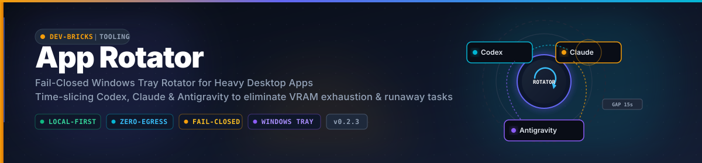
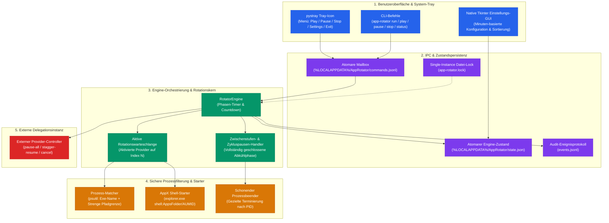
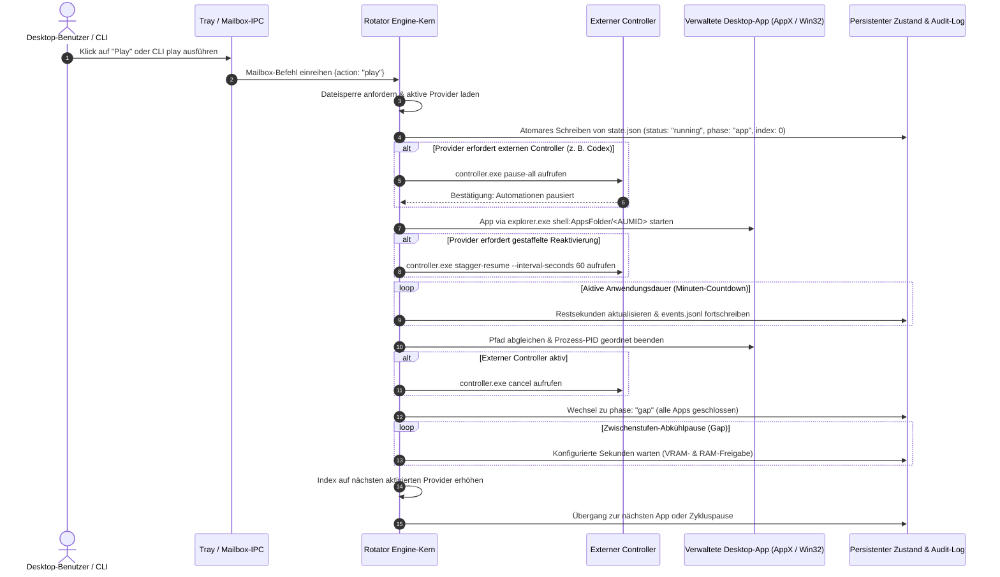

<p align="center">
  
</p>

# App Rotator

<p align="center">
  <strong>Konfigurierbarer, Fail-Closed Windows-Tray-Rotator für ressourcenintensive Desktop-Apps</strong><br>
  <em>Deterministisches Time-Slicing lokaler KI-Anwendungen (Codex Desktop, Claude Desktop, Antigravity IDE) zur Vermeidung von VRAM-Erschöpfung, GPU-Konflikten und unkontrollierten Hintergrundprozessen.</em>
</p>

<p align="center">
  <a href="README.md"><strong>English</strong></a> |
  <a href="README_de.md"><strong>Deutsch</strong></a>
</p>

<p align="center">
  <a href="https://github.com/dev-bricks/app-rotator/actions/workflows/tests.yml"></a>
  <a href="https://github.com/dev-bricks/app-rotator/releases"></a>
  <a href="https://github.com/dev-bricks/app-rotator"></a>
  <a href="https://www.python.org/"></a>
  <a href="https://github.com/dev-bricks/app-rotator"></a>
  <a href="LICENSE"></a>
  <a href="SECURITY.md"></a>
  <a href="SECURITY.md"></a>
  <a href="SECURITY.md"></a>
  <a href="https://astral.sh/ruff"></a>
  <a href="https://github.com/dev-bricks"></a>
  <a href="https://github.com/open-bricks"></a>
  <a href="llms.txt"></a>
  <a href="MARKETING-LOG.txt"></a>
</p>

---

### 🧭 Schnellnavigation

- [1. Warum dieses Projekt existiert](#warum-dieses-projekt-existiert)
- [2. Systemarchitektur & Zustandsautomaten-Fluss](#systemarchitektur--zustandsautomaten-fluss)
- [3. Zustandslogik & Zyklusdynamik](#zustandslogik--zyklusdynamik)
- [4. Sichere Prozessauswahl & AppX-Start](#sichere-prozessauswahl--appx-start)
- [5. Externer Codex-Safe-Start-Vertrag](#externer-codex-safe-start-vertrag)
- [6. System-Tray & Native Einstellungs-UI](#system-tray--native-einstellungs-ui)
- [7. Benutzerbezogene Desktop-Installation](#benutzerbezogene-desktop-installation)
- [8. Governance- & Laufzeit-Invarianten](#governance---laufzeit-invarianten)
- [9. End-to-End Ausführungslebenszyklus](#end-to-end-ausfuehrungslebenszyklus)
- [10. Geschwisterwerkzeuge & Partner-Matrix](#geschwisterwerkzeuge--partner-matrix)
- [11. Installation & CLI-Bedienung](#installation--cli-bedienung)
- [12. Konfiguration & Schema-Migration](#konfiguration--schema-migration)
- [13. Sicherheit & Zero-Egress-Datenschutz](#sicherheit--zero-egress-datenschutz)
- [14. Entwicklung & Verifikation](#entwicklung--verifikation)

---

## Warum dieses Projekt existiert

Moderne KI- und Agenten-Entwicklungsworkflows stützen sich zunehmend auf lokale Desktop-Umgebungen wie **Codex Desktop**, **Claude Desktop** und die **Antigravity IDE**. Laufen mehrere dieser Schwergewichte gleichzeitig oder unbeaufsichtigt im Hintergrund, kommt es auf modernen Entwickler-Workstations rasch zu drastischen Engpässen:

1. **VRAM-Erschöpfung & GPU-Konflikte**: Lokale Inferenz-Engines und grafikbeschleunigte WebView-Oberflächen konkurrieren um dedizierten Videospeicher (VRAM). Dies führt zu Grafiktreiber-Resets, spürbaren Frame-Einbrüchen und blockierten Systemressourcen.
2. **Speicherlecks & CPU-Auslastung**: Unbegrenzte Hintergrundaktivitäten und permanente Datei-Indexierungsschleifen beanspruchen massiv Arbeitsspeicher und verlangsamen parallele Compiler und IDEs.
3. **Unkontrollierte Hintergrund-Automationen**: Von inaktiven Desktop-Apps gestartete Hintergrund-Agenten, Datei-Watcher und MCP-Server laufen unbemerkt weiter und erzeugen unkontrollierte Race Conditions auf geteilten Repositories.
4. **Thermisches Throttling & unnötige Leistungsaufnahme**: Dauerhaft parallel laufende Desktop-Clients halten Workstations in hohen Leistungszuständen, was Lüfterlärm und thermische Drosselung provoziert.

`app-rotator` löst diese Probleme durch diszipliniertes, zeitgesteuertes Desktop-Orchestrieren. Als lokaler Windows-Tray-Dienst stellt das Tool sicher, dass **zu jedem Zeitpunkt genau eine konfigurierte Anwendung aktiv ist**. Nach Ablauf des zugewiesenen Zeitfensters schließt App Rotator das Programm sauber, hält eine vollständige Leerlaufphase (Inter-App-Gap) zur Bereinigung von VRAM und Speicher-Caches ein und startet anschließend das nächste definierte Werkzeug.

Im Auslieferungszustand ist die Konfiguration **standardmäßig deaktiviert und im Dry-Run-Modus**. Sie protokolliert alle geplanten Schritte, ohne tatsächlich Prozesse zu beenden oder zu starten, bis der Anwender dies ausdrücklich aktiviert.

---

## Systemarchitektur & Zustandsautomaten-Fluss

Das folgende Architekturdiagramm veranschaulicht das Zusammenspiel der entkoppelten Teilsysteme:



---

## Zustandslogik & Zyklusdynamik

App Rotator implementiert einen deterministischen Zustandsautomaten mit vier Hauptbetriebszuständen:

- **Stopped (Gestoppt)**: Alle verwalteten Anwendungen sind garantiert geschlossen. Der Rotationsindex steht auf `0`. Ein Klick auf *Play* schließt eventuell verbliebene Fremdprozesse und startet Provider `0` mit frischem Timer.
- **Running (Laufend)**: Die Engine befindet sich in einer aktiven Phase. In einer `app`-Phase wird die laufende Anwendung überwacht. In einer `gap`- oder `cycle_pause`-Phase bleiben alle verwalteten Apps ausnahmslos geschlossen.
- **Paused (Pausiert)**: Ein Klick auf *Pause* schließt die aktuelle App sofort, sendet ein Abbruchsignal an externe Controller und friert die Restzeit, den aktuellen Provider-Index und die Phase präzise ein.
- **Play aus Pausiert**: Setzt die exakt eingefrorene Phase mit der verbliebenen Restlaufzeit fort. Wurde während einer `app`-Phase pausiert, wird die Anwendung sauber neu gestartet.
- **Stop / Aus**: Beendet die laufende Anwendung, ruft `cancel` am externen Controller auf, setzt den Rotationsindex auf `0` zurück und persistiert den Leerlaufzustand.
- **Automatischer Gesamtlaufzeit-Stop**: Ein optionaler Gesamtlaufzeit-Wächter (`overall_stop_seconds`) führt die identische sichere *Stop*-Operation nach Erreichen der kumulierten aktiven Betriebsdauer aus. Pausenzeiten verbrauchen dieses Kontingent nicht.
- **Zyklusablauf**:
  $$\text{App-Phase } N \longrightarrow \text{Inter-App-Gap} \longrightarrow \text{App-Phase } N+1 \longrightarrow \dots \longrightarrow \text{Zykluspause} \longrightarrow \text{App-Phase } 0$$

Jede Zustandsänderung wird über temporäre Dateien und atomare Dateieretzung (`os.replace`) in `%LOCALAPPDATA%\AppRotator\state.json` geschrieben. Ein plötzlicher Stromausfall oder Prozessabbruch kann dadurch niemals zu unvollständigen JSON-Dateien führen.

---

## Sichere Prozessauswahl & AppX-Start

Das automatische Schließen von Prozessen birgt erhebliche Risiken, wenn Kriterien ungenau formuliert sind. App Rotator erzwingt daher ein striktes Fail-Closed-Sicherheitsmodell:

1. **Doppeltes Prüfkriterium**: Jeder konfigurierte Provider erfordert zwingend einen Prozessnamen (z. B. `ChatGPT.exe`) **und genau eine Pfadprüfung** (`path_exact` oder `path_contains`).
2. **Ausschluss unlesbarer Prozesse**: Prozesse ohne lesbare Pfadangabe oder mit fremden Administratorrechten werden vollständig ignoriert.
3. **Schutz von CLI- und Entwicklerwerkzeugen**: Durch die strikte Begrenzung von Codex Desktop auf `WindowsApps\OpenAI.Codex_` bleiben Konsolenwerkzeuge wie npm `codex.exe` oder Entwicklerprozesse in Terminal-Fenstern vollkommen unberührt.
4. **AppX-Startprotokoll**: Moderne UWP- und MSIX-Apps aus dem Microsoft Store können aufgrund von Windows-Sandbox-Restriktionen nicht direkt über `.exe`-Pfade gestartet werden. App Rotator nutzt das standardisierte Windows Shell-Protokoll:
   ```text
   explorer.exe shell:AppsFolder\<AUMID>
   ```
   Hinterlegte AUMIDs:
   - **Codex Desktop**: `OpenAI.Codex_2p2nqsd0c76g0!App`
   - **Claude Desktop**: `Claude_pzs8sxrjxfjjc!Claude`
   - **Antigravity**: Direkter Start über verifizierten absoluten Dateipfad (`path_exact`)

---

## Externer Codex-Safe-Start-Vertrag

App Rotator folgt dem Prinzip der klaren Aufgabentrennung: **Das Tool liest, parst oder manipuliert niemals interne Provider-Konfigurationen wie `automation.toml`**.

Stattdessen wird die Steuerung provider-spezifischer Hintergrundaufgaben an einen externen, ungebündelten Controller delegiert:

```text
controller.exe pause-all
controller.exe stagger-resume --interval-seconds 60
controller.exe cancel
```

### Ablauf des Delegationsvertrags:
1. **Vor dem Start von Codex**: Die Engine ruft `controller.exe pause-all` auf, um sicherzustellen, dass keine automatisierten Hintergrundaufgaben zeitgleich anlaufen.
2. **Gestaffelte Reaktivierung**: Nach dem Start von Codex ruft die Engine `controller.exe stagger-resume --interval-seconds 60` auf, um Automationen schrittweise und schonend zu reaktivieren.
3. **Beim Verlassen der Phase / Pause / Stop**: Die Engine sendet `controller.exe cancel`, um ausstehende Reaktivierungen sofort zu verwerfen.
4. **Verhalten bei fehlendem Controller**:
   - `missing_behavior: "block"` (Standard): Die Rotation stoppt sicher, wechselt in einen Fehlerzustand und protokolliert die Ursache.
   - `missing_behavior: "skip"`: Die Engine überspringt die Codex-Phase und geht direkt zum nächsten Provider über.
   - **Dry-Run**: Befehle werden lediglich im Ereignisprotokoll erfasst, ohne Unterprozesse aufzurufen.

---

## System-Tray & Native Einstellungs-UI

Die Desktop-Oberfläche ist auf maximale Zuverlässigkeit und unaufdringliche Bedienung ausgelegt:

- **System-Tray-Icon (`pystray`)**:
  - Farbcodierte Statussymbole für Leerlauf, aktiven Betrieb, Pause und Abkühlphase.
  - Das Kontextmenü zeigt den aktiven Provider, die aktuelle Phase und die verbleibende Restzeit an.
  - Befehle: *Play*, *Pause*, *Stop*, *Settings* und *Exit*.
- **Native Einstellungs-GUI (`tkinter`)**:
  - Leichtgewichtiges, lokales Einstellungsfenster ohne externe Web-Abhängigkeiten.
  - **Minuten-basierte Eingaben**: Alle Zeiträume (Laufzeiten der Apps, Zwischenpausen, Zykluspause, Gesamtlaufzeit, Reaktivierungsabstände) werden für den Nutzer intuitiv in **Minuten** gepflegt und angezeigt. Intern rechnet die Engine sekundengenau.
  - **Provider-Verwaltung**: Eigene Checkboxen (*Aktiv / in Rotation*) erlauben das temporäre Deaktivieren einzelner Anwendungen, ohne deren Pfadeinstellungen zu löschen. Die Standard-Apps können nicht versehentlich gelöscht und flexibel sortiert werden.

---

## Benutzerbezogene Desktop-Installation

App Rotator enthält ein unprivilegiertes PowerShell-Installationsskript für den aktuellen Benutzer:

```powershell
.\scripts\install-desktop-shortcut.ps1
```

### Installationsgarantien:
- **Keine Administratorrechte erforderlich**: Die Installation erfolgt vollständig im Benutzerprofil unter `%LOCALAPPDATA%\Programs\AppRotator`.
- **Echte Desktop-Verknüpfung**: Ermittelt den tatsächlichen Windows-Desktop-Ordner über die Windows-API – unabhängig von OneDrive-Umleitungen oder lokalen Git-Pfaden.
- **Automatische Umgebungserstellung**: Erstellt eine isolierte virtuelle Python-Umgebung, installiert App Rotator im Benutzermodus, hinterlegt hochauflösende Icons und erzeugt die sichere Grundkonfiguration.

---

## Governance- & Laufzeit-Invarianten

Die folgenden 10 Invarianten sichern jede Ausführung von `app-rotator` verbindlich ab:

| Garantie | Invarianten-Code | Durchsetzungsmechanismus | Verifikationsregel |
| :--- | :--- | :--- | :--- |
| **1. 100% Local-First Datenschutz** | `INV-LOCAL-01` | Vollständiger Verzicht auf Netzwerk-Sockets, Telemetrie und Cloud-Sync. | Quellcode-Audit belegt 0 ausgehende HTTP-/Netzwerkanfragen. |
| **2. Unprivilegierte Ausführung** | `INV-UNPRIV-02` | Standard-Benutzerkontext (`RunAsInvoker`), keine Rechteausweitung. | `SECURITY.md` und Laufzeitprüfungen belegen Non-Elevation. |
| **3. Fail-Closed Dry-Run** | `INV-DRYRUN-03` | Auslieferungskonfiguration mit `enabled: false` und `dry_run: true`. | Saubere Neuinstallation startet keine Prozesse ohne Aktivierung. |
| **4. Strikte Pfad-Begrenzung** | `INV-SCOPING-04` | Prozess-Matching erfordert Dateinamen und explizite Pfadprüfung. | psutil-Audit weist unklare oder abweichende Prozesse ab. |
| **5. Atomare Persistenz** | `INV-ATOMIC-05` | Zustands- und Mailbox-Schreibvorgänge via Temp-Datei + atomarem Ersetzen. | Stromausfall-Simulationen belegen korruptionsfreie Speicherung. |
| **6. Provider-Delegationsvertrag** | `INV-DELEGATION-06` | Hintergrundautomationen werden nur über externe CLIs gesteuert. | Kein direktes Lesen oder Schreiben interner Provider-Configs. |
| **7. Single-Instance Dateisperre** | `INV-LOCKFILE-07` | Exklusive Dateisperre (`app-rotator.lock`) für Tray und Engine. | Zweitstart bricht sofort mit definiertem Exit-Code ab. |
| **8. Nicht-invasive AppX-Nutzung** | `INV-AUMID-08` | UWP-/MSIX-Aktivierung über standardisiertes Windows Shell AppFolder. | Subprocess-Aufrufe nutzen feste Parametervektoren ohne Shell. |
| **9. Cloud-Sync-Resilienz** | `INV-SYNC-09` | Laufzeitdaten unter `%LOCALAPPDATA%`; `.gitignore` Konfliktfilter. | Datenablage außerhalb von OneDrive; Git ignoriert Sync-Kopien. |
| **10. 48h Sicherheits-SLA** | `INV-SLA-10` | 48h Eingangsbestätigung und verbindliche 5-Werktage-Triage-Zusage. | Dokumentiert in `SECURITY.md` und abgesichert durch Tests. |

---

## End-to-End Ausführungslebenszyklus

Das folgende Sequenzdiagramm verdeutlicht den vollständigen Ablauf eines Rotationszyklus:



---

## Geschwisterwerkzeuge & Partner-Matrix

`app-rotator` ist Teil der Werkzeuglinie von **dev-bricks** unter dem Dach von **open-bricks**:

| Repository | Bereich & Aufgabe | Rolle im Zusammenspiel mit App Rotator |
| :--- | :--- | :--- |
| [WikiStub-Seed](https://github.com/dev-bricks/WikiStub-Seed) | Markdown-Generierung & Dokumentationswerkzeuge | Liefert strukturierte Wissensnetze für Entwickler. |
| [PrivacyMailDesk](https://github.com/dev-bricks/privacymaildesk) | Lokale E-Mail-Sichtung & Triage | Vollständig privater, offlinefähiger Postfach-Desk. |
| [githubbot](https://github.com/dev-bricks/githubbot) | Multi-Repo GitHub-Betreuung & CI-Hygiene | Steuert Veröffentlichungen, Metadaten-Parität und Qualitäts-Gates. |
| [system-auditor](https://github.com/ellmos-ai/system-auditor) | Multi-Host Audit-Engine & Lock-Governance | Überwacht Sperrsysteme und Multi-Host-Synchronisation. |
| [system-explorer](https://github.com/ellmos-ai/system-explorer) | Lokale Systemanalyse & Hardware-Erkennung | Analysiert Prozess-Arbeitsspeicher, GPU-Auslastung und Temperaturen. |
| [ellmos-controlcenter-mcp](https://github.com/ellmos-ai/ellmos-controlcenter-mcp) | Governance- & Berechtigungszentrale | Koordiniert Agenten-Fähigkeiten und Befugnisgrenzen. |
| [ellmos-delegation-authority](https://github.com/ellmos-ai/ellmos-delegation-authority) | Kryptografische Aufgaben-Delegationstoken | Stellt belegbare Tokens für automatisierte Aufgaben bereit. |
| [sqlite-transit-sync](https://github.com/ellmos-ai/sqlite-transit-sync) | Konfliktfreie Datenbank-Synchronisation | Ermöglicht atomaren Datenabgleich über mehrere Hosts. |
| [clip-storyboard-director](https://github.com/ellmos-ai/clip-storyboard-director) | Lokale KI-Video-Regie-Pipeline | Profitiert von zeitgesteuerter, exklusiver Hardware-Nutzung. |
| [ellmos-voice-io](https://github.com/ellmos-ai/ellmos-voice-io) | Sprachsynthese & Audio-Streaming | Verwaltet rechenintensive lokale Sprachmodelle. |
| [automation-master](https://github.com/ellmos-ai/automation-master) | Enterprise Hintergrundaufgaben-Steuerung | Koordiniert zeitgesteuerte Hintergrundprozesse. |
| [ExplorerPro](https://github.com/file-bricks/ExplorerPro) | Dateimanager mit Tabs für Entwickler | Übersichtlicher Dateimanager für Projektressourcen. |
| [ProSync](https://github.com/file-bricks/prosync) | Resiliente Dateispiegelung & Backup | Spiegelt Projektdaten zuverlässig auf lokale Sicherungsmedien. |
| [CleanMarkdown](https://github.com/doc-bricks/cleanmarkdown) | Dokumentations-Sanitizer & Linter | Bereinigt Markdown-Dateien und verhindert Formatierungsfehler. |
| [KlangpultLight](https://github.com/entertain-and-more/KlangpultLight) | Zero-Egress Soundboard & Desktop-Recorder | Lokales Begleitwerkzeug für Audio-Aufnahmen. |
| [open-bricks](https://github.com/open-bricks) | Dachorganisation für Open-Source-Software | Definiert Architektur-Standards, Sicherheits-SLAs und Release-Zyklen. |

---

## Installation & CLI-Bedienung

### Systemvoraussetzungen
- **Betriebssystem**: Microsoft Windows 10 oder Windows 11 (64-Bit)
- **Python**: Version 3.11, 3.12 oder 3.13
- **Abhängigkeiten**: `Pillow`, `psutil`, `pystray`

### Lokale Installation

```powershell
$env:PYTHONIOENCODING = "utf-8"
python -m venv .venv
.\.venv\Scripts\python.exe -m pip install -e ".[dev]"
```

### Initialisierung & Validierung der Konfiguration

```powershell
# Sichere Grundkonfiguration anlegen
app-rotator config-init

# Konfiguration auf syntaktische und logische Gültigkeit prüfen
app-rotator config-validate
```

### Wichtige CLI-Befehle

```powershell
# System-Tray-Anwendung starten
app-rotator tray

# Rotations-Engine im Konsolenvordergrund starten
app-rotator run

# Aktuellen Status, laufenden Provider und Restzeit abfragen
app-rotator status

# Steuerbefehle atomar über die Mailbox übermitteln
app-rotator play
app-rotator pause
app-rotator stop
```

---

## Konfiguration & Schema-Migration

Die Konfigurationsdatei von App Rotator liegt unter `%LOCALAPPDATA%\AppRotator\config.json`.

```json
{
  "schema_version": 2,
  "enabled": false,
  "dry_run": true,
  "cycle_pause_seconds": 300,
  "default_gap_seconds": 60,
  "overall_stop_seconds": 0,
  "codex_controller": {
    "executable": "",
    "missing_behavior": "block",
    "reactivation_spacing_seconds": 60
  },
  "providers": [
    {
      "name": "Codex Desktop",
      "process_name": "ChatGPT.exe",
      "path_contains": "WindowsApps\\OpenAI.Codex_",
      "aumid": "OpenAI.Codex_2p2nqsd0c76g0!App",
      "duration_seconds": 1800,
      "enabled": true
    },
    {
      "name": "Claude Desktop",
      "process_name": "Claude.exe",
      "path_contains": "WindowsApps\\Claude_",
      "aumid": "Claude_pzs8sxrjxfjjc!Claude",
      "duration_seconds": 1800,
      "enabled": true
    },
    {
      "name": "Antigravity",
      "process_name": "Antigravity.exe",
      "path_exact": "C:\\Users\\User\\AppData\\Local\\Programs\\Antigravity\\Antigravity.exe",
      "executable": "C:\\Users\\User\\AppData\\Local\\Programs\\Antigravity\\Antigravity.exe",
      "duration_seconds": 1800,
      "enabled": false
    }
  ]
}
```

### Garantien bei der Schema-Migration:
- **Automatisches Upgrade von v1 auf v2**: Bestehende Konfigurationsdateien werden beim Einlesen ohne Datenverlust auf Version 2 aktualisiert.
- **Deaktivierte Standardeinträge**: Neu hinzugefügte Standard-Provider (wie Antigravity) werden beim Migrieren mit `enabled: false` angehängt, um eine laufende Benutzerkonfiguration niemals eigenmächtig zu verändern.

---

## Sicherheit & Zero-Egress-Datenschutz

App Rotator wurde nach strengen Sicherheits- und Datenschutzprinzipien entwickelt:

- **Keinerlei Netzwerkzugriff**: Das Tool öffnet keine Netzwerk-Sockets, sammelt keine Nutzungsdaten und baut keinerlei Verbindung zu externen Servern auf.
- **Unprivilegierte Ausführung (`RunAsInvoker`)**: Zu keinem Zeitpunkt werden Administratorrechte angefordert. Das Tool arbeitet vollständig im normalen Benutzerkontext.
- **Striktes Pfad-Sandboxing**: Prozesse werden nur dann beendet, wenn ihr Ausführungspfad zweifelsfrei mit den definierten Filtern übereinstimmt.
- **48-Stunden-Reaktions-SLA & 5-Werktage-Triage**: Sicherheitsmeldungen werden binnen 48 Stunden bestätigt und innerhalb von maximal 5 Werktagen technisch bewertet. Details siehe [SECURITY.md](SECURITY.md).

---

## Entwicklung & Verifikation

### Linter & Bytecode-Validierung ausführen

```powershell
$env:PYTHONIOENCODING = "utf-8"
python -m ruff check .
python -m compileall -q src tests
```

### Vollständige Testsuite ausführen

```powershell
$env:PYTHONIOENCODING = "utf-8"
python -m pytest -v
```

---

<p align="center">
  Teil der <strong><a href="https://github.com/dev-bricks">dev-bricks</a></strong> Suite unter dem Dach von <strong><a href="https://github.com/open-bricks">open-bricks</a></strong>.
</p>
